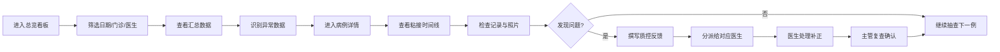

## 1. 产品概述

连锁口腔门诊正畸质控看板，面向正畸运营主管，将各分院附件粘接记录从病历附件转化为可复盘的质量数据，实现粘接质量的可视化管理与持续改进。

- 目标用户：连锁口腔门诊正畸运营主管、质控负责人
- 核心价值：通过数据化管理提升附件粘接质量，降低重粘率，规范诊疗操作
- 产品范围：总览看板、病例详情、反馈列表三大模块

## 2. 核心功能

### 2.1 用户角色

| 角色 | 说明 | 核心权限 |
|------|------|----------|
| 运营主管 | 正畸质控负责人，跨分院管理 | 查看全部门诊数据、抽查病例、发布质控反馈 |
| 门诊医生 | 各分院正畸临床医生 | 查看本人反馈、处理补正任务 |

### 2.2 功能模块

1. **总览看板**：门诊汇总数据、筛选维度、异常数据高亮提示
2. **病例详情**：患者粘接时间线、每次记录详情、口内照片查看
3. **反馈列表**：质控反馈管理、分派医生、补正状态追踪

### 2.3 页面详情

| 页面名称 | 模块名称 | 功能描述 |
|---------|---------|----------|
| 总览看板 | 顶部筛选栏 | 按日期范围、分院、医生、病例阶段筛选数据 |
| 总览看板 | 数据概览卡片 | 展示粘接人数、附件颗数、重粘次数、缺失记录数四项核心指标 |
| 总览看板 | 门诊数据表格 | 各分院/医生的详细数据列表，异常数据用红色醒目标识 |
| 总览看板 | 趋势图表 | 近7/30天粘接量与重粘率趋势图 |
| 病例详情 | 患者基本信息 | 患者姓名、编号、年龄、主治医生、当前阶段 |
| 病例详情 | 粘接时间线 | 初粘、复粘、复诊检查的纵向时间线，含时间、类型、操作者 |
| 病例详情 | 记录详情卡片 | 每次记录的牙位、附件形态、口内照片、备注信息 |
| 病例详情 | 快捷反馈入口 | 在记录详情中直接发起质控反馈 |
| 反馈列表 | 反馈统计概览 | 待处理、处理中、已完成的反馈数量统计 |
| 反馈列表 | 反馈列表 | 按状态、分院、医生筛选的反馈条目列表 |
| 反馈列表 | 反馈详情弹窗 | 查看反馈内容、补正记录、沟通历史 |

## 3. 核心流程

主管日常质控工作流程：进入总览看板 → 筛选查看当日数据 → 识别异常数据（高重粘率、缺失记录）→ 点击进入病例详情 → 逐条查看粘接记录与照片 → 发现问题后撰写质控反馈 → 分派给对应医生 → 医生处理补正 → 主管复查确认。

## 4. 用户界面设计

### 4.1 设计风格

- **主色调**：深海蓝 #165DFF，代表专业、可信赖的医疗管理调性
- **辅助色**：青蓝 #4080FF、浅蓝 #E8F3FF
- **警示色**：珊瑚红 #F53F3F（异常数据）、琥珀橙 #FF7D00（待处理）、苔绿 #00B42A（正常/已完成）
- **中性色**：深灰 #1D2129、中灰 #4E5969、浅灰 #C9CDD4、背景 #F2F3F5
- **字体**：中文使用「思源黑体」/「PingFang SC」，数字使用等宽字体增强数据可读性
- **按钮风格**：圆角 6px，主按钮实色填充，次按钮描边样式
- **布局风格**：左侧导航 + 右侧内容区，卡片式布局，数据表格为核心展示形式
- **图标风格**：线性图标，统一 24px 尺寸，与主色调保持一致

### 4.2 页面设计概述

| 页面名称 | 模块名称 | UI元素 |
|---------|---------|--------|
| 总览看板 | 顶部筛选栏 | 日期选择器、下拉选择框、搜索框、筛选按钮，浅灰背景 |
| 总览看板 | 数据概览卡片 | 四张并排卡片，大数字展示，底部带趋势箭头，卡片悬浮阴影 |
| 总览看板 | 门诊数据表格 | 斑马纹表格，异常行红色背景/文字，支持排序与跳转 |
| 总览看板 | 趋势图表 | 双Y轴折线图，粘接量柱状 + 重粘率折线 |
| 病例详情 | 患者信息头 | 左侧头像/姓名，右侧标签组（阶段、分院、医生） |
| 病例详情 | 粘接时间线 | 左侧时间轴，右侧记录卡片，不同类型用不同颜色标记 |
| 病例详情 | 记录详情 | 牙位示意图、附件形态标签、照片轮播、备注文本块 |
| 反馈列表 | 状态标签栏 | Tab切换：全部、待处理、处理中、已完成、已驳回 |
| 反馈列表 | 反馈列表项 | 左侧患者信息，中间反馈内容摘要，右侧状态标签与操作按钮 |
| 反馈列表 | 详情弹窗 | 左右分栏，左侧反馈历史，右侧补正操作区 |

### 4.3 响应式

- 桌面端优先设计，最小支持宽度 1280px
- 平板端自适应缩放，表格支持横向滚动
- 不强制适配移动端，主要面向桌面办公场景

### 4.4 动效设计

- 页面加载：卡片依次淡入上浮，延迟 50ms 递增
- 数据刷新：数字滚动动画过渡
- 悬停效果：表格行浅蓝背景高亮，按钮轻微放大
- 弹窗：从顶部下滑 + 淡入，背景模糊遮罩
- 时间线：首次进入时逐条从左滑入
