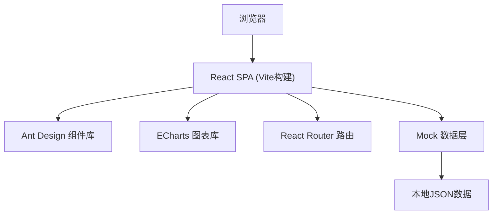
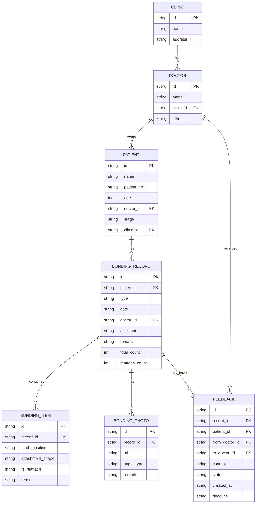

## 1. 架构设计

前端单页应用架构，使用 React 18 + TypeScript + Vite 构建，UI 组件库采用 Ant Design，图表使用 ECharts，数据使用 Mock 数据模拟后端接口。



## 2. 技术描述

- **前端框架**：React 18 + TypeScript
- **构建工具**：Vite 5
- **UI 组件库**：Ant Design 5
- **图表库**：ECharts 5
- **路由**：React Router v6
- **状态管理**：React Context + useReducer（轻量场景）
- **样式方案**：CSS Modules + Less
- **图标**：@ant-design/icons
- **后端**：无后端，使用 Mock 数据模拟
- **数据**：本地 JSON Mock 数据

## 3. 路由定义

| 路由 | 页面 | 说明 |
|------|------|------|
| / | 总览看板 | 首页，门诊汇总数据展示 |
| /dashboard | 总览看板 | 同上，别名路由 |
| /case/:id | 病例详情 | 患者粘接记录时间线与详情 |
| /feedback | 反馈列表 | 质控反馈管理列表 |

## 4. 数据模型

### 4.1 数据模型定义



### 4.2 数据结构定义

```typescript
// 门诊
interface Clinic {
  id: string;
  name: string;
  address: string;
}

// 医生
interface Doctor {
  id: string;
  name: string;
  clinicId: string;
  title: string;
}

// 患者
interface Patient {
  id: string;
  name: string;
  patientNo: string;
  age: number;
  doctorId: string;
  stage: 'initial' | 'middle' | 'late' | 'finishing';
  clinicId: string;
  totalAttachments: number;
  reattachCount: number;
}

// 粘接记录类型
type BondingType = 'initial' | 'reattach' | 'checkup';

// 粘接记录
interface BondingRecord {
  id: string;
  patientId: string;
  type: BondingType;
  date: string;
  doctorId: string;
  doctorName: string;
  assistant?: string;
  remark?: string;
  totalCount: number;
  reattachCount: number;
  items: BondingItem[];
  photos: BondingPhoto[];
}

// 粘接条目
interface BondingItem {
  id: string;
  toothPosition: string;
  attachmentShape: string;
  isReattach: boolean;
  reason?: string;
}

// 粘接照片
interface BondingPhoto {
  id: string;
  angleType: 'front' | 'lateral' | 'occlusal' | 'other';
  url: string;
  remark?: string;
}

// 反馈状态
type FeedbackStatus = 'pending' | 'processing' | 'completed' | 'rejected';

// 质控反馈
interface Feedback {
  id: string;
  recordId: string;
  patientId: string;
  patientName: string;
  fromDoctorId: string;
  fromDoctorName: string;
  toDoctorId: string;
  toDoctorName: string;
  content: string;
  status: FeedbackStatus;
  createdAt: string;
  deadline?: string;
  reply?: string;
  replyAt?: string;
  clinicId: string;
  clinicName: string;
}

// 汇总数据
interface SummaryData {
  date: string;
  clinicId: string;
  clinicName: string;
  patientCount: number;
  totalAttachments: number;
  reattachCount: number;
  missingRecords: number;
  reattachRate: number;
}
```

## 5. 目录结构

```
src/
├── assets/           # 静态资源
│   └── images/
├── components/       # 通用组件
│   ├── Layout/       # 布局组件
│   ├── Dashboard/    # 看板组件
│   ├── CaseDetail/   # 病例详情组件
│   └── Feedback/     # 反馈组件
├── pages/            # 页面组件
│   ├── Dashboard.tsx
│   ├── CaseDetail.tsx
│   └── Feedback.tsx
├── mock/             # Mock 数据
│   ├── clinics.ts
│   ├── doctors.ts
│   ├── patients.ts
│   ├── records.ts
│   └── feedbacks.ts
├── types/            # TypeScript 类型定义
│   └── index.ts
├── utils/            # 工具函数
│   └── index.ts
├── App.tsx
├── main.tsx
└── index.css
```
